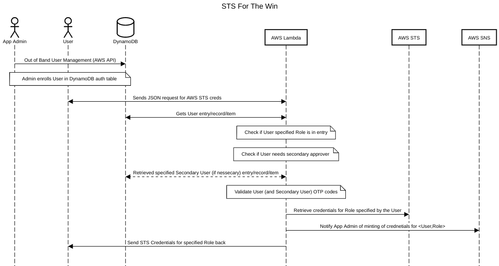

STSFTW
===============

## What?
STSFTW is a service that allows you to link your Google Authenticator (or similar) to an internet-facing service ran in AWS for the purpose of generating AWS STS creds.

This will let you get rid of permanent creds on your dev machine and never run the risk of checking in or publishing usable keys (YIKES).

## How is this different?

STSFTW (this project) uses MFA and Multi-Party Auth to take the place of a tradional password/mfa provided by an Idenity platform.

This means that as a user/operater of this project, you can get rid of all of your local, permanent creds for AWS and rely only on TOTP for you auth. And, in the case you feel like you need more tinfoil, you can enroll another device (or a second profile on the same device) to provide either 2 TOTP code or a genuine Multi-Part Auth.

## How it Works

Each entry in the auth table for this project has the following values:

- *issuer* - The issue is a logical grouping of users
- *account_name* - The name of the user to be added to the issuer group
- *url* - The TOTP URL used to validate the client for the (issuer, account_name) pair
- *roles* - A list of AWS Role Names that the (issuer, account_name) can be granted
- *SecondaryAuthorization* - A list of account_names within the same issuer which can act as the Multi-Party Auth provider

These entries are added to the table by the application admin (or any user with AWS IAM access to this DynamoDB table).

Once the authorization table has been updated and a user enrolled, the user can use the `get` command to get AWS STS creds for the supplied role.

These AWS STS creds are provided by a AWS Lambda, AWS ALB setup in which (for the example case in this repo) has an AWS Route53 entry. This allows for clients to be able to access the API via HTTPS and have a privileged AWS Lambda do the AWS STS call to provide the creds.

### Sequence Diagram of Protocol



## Getting Started

### Prerequisites

1. An AWS account in which you have permissions for:
    - SNS
    - EC2/VPC
    - Lambda
    - Route53
    - ACM
    - DynamoDB
    - IAM

1. A Zone in Route53 that you have access to

1. Go installed on your local system (or wherever you are building this)

1. AWS CLI installed and active credentials (still need bootstrapping creds)

1. A designated Admin for the application

1. Make installed

1. Terrafform 1.0.0+ installed

1. Terragrunt installed

### Infrastructure

#### Create YAML Config for Terragrunt Deployment

```yaml
bin_path: <path to this projects build dir or where the bins are stored>
bin_name: <name of the binary to use for the lambda>
app_name: <name of application - will be used for AWS resource naming>
zone: <the Route53 zone to use to create certificates and add A/CNAME/ALIAS records to>
domain: <the domain name created in Route53 that points to the ALB>
dynamo_table_name: <name of the DynamoDB table to create and use for auth>
tf_state_bucket: <S3 bucker name for terraform/terragrunt state>
email: <email address to send audit notifications to>
region: <AWS region to deploy to>
```

The above yaml content can be used to create a new yaml configuration file at `<repo root>/terraform/terragrunt/app.yml`.

#### Deploy

```sh
make deploy
```

This step will build and provision all of the necessary resources to run the project. It will build a golang based binary for the lambda and directly upload it when provisioning in AWS.

*NOTE*: Once this deploy is finished you will need to check the provided email to enroll in the SNS notifications.

#### Getting a Local Binary

```sh
make build_local_bin
```

You will need `sudo` privileges to be able to run this command as it will try and place the newly created binary in `/usr/local/bin`.

### Adding Users

#### Admin User

It is recommended to create an Admin user that has no roles assigned to them. This way there is one privileged account with STSFTW that can solely be used for Multi-Party Authentication and nothing else.

To create this admin user, run:

```sh
sts enroll --account-name admin --issuer $STS_ISSUER --table-name $STS_TABLE_NAME
```

Once this user has been created, we can use it to be the Multi-Party Authentication user for a user with admin priveleges.

#### First User

As mentioned above, we'll create a user that has an administrative role assigned.

For this example, we created a IAM Role `AccountAdmin` with the AWS managed policy `AdministratorAccess` attached.

```sh
sts enroll --account-name account-admin  --table-name $STS_TABLE_NAME --issuer $STS_ISSUER --roles AccountAdmin --secondary-authorizers admin
```

The IAM Role doesn't need to exist when enrolling users but will need to exist when getting credentials for the first time.

To get credentials for this user:

```sh
sts get --account-name account-admin --secondary-authorizer admin --endpoint $STS_ENDPOINT --issuer $STS_ISSUER --role AccountAdmin --totp-code 111111 --secondary-totp-code 222222
```

If this is successful, you'll get a printout of the credentials:

```sh
export AWS_ACCESS_KEY_ID=XXXXXXXXXX
export AWS_SECRET_ACCESS_KEY=XXXXXXXXXX
export AWS_SESSION_TOKEN=XXXXXXXXXX
```

You can also exec the command to directly export the creds to your current session:

```sh
$(sts get --account-name account-admin --secondary-authorizer admin --endpoint $STS_ENDPOINT --issuer $STS_ISSUER --role AccountAdmin --totp-code 111111 --secondary-totp-code 222222)
```

And, you should get an email showing this transaction happened:

```
STSFTW has minted new STS crentials:
Issuer: Some Account
Account Name: account-admin
AWS Role: AccountAdmin

```

#### ENV Vars and CLI Args

The STS client can be configured with both flags and ENV vars. Setting the ENV vars can allow a more simplified experience when using the cli.

| ENV var | cli flag | description |
|---|---|---|
| STS_ISSUER | issuer | Issuer is used for logical group managment. Set value is used for the current operation. |
| STS_ACCOUNT_NAME | account-name | Account name is the user in question for the current operation |
| STS_TABLE_NAME | table-name | Name of the DynamoDB table used for the auth table. |
| STS_ENDPOINT | endpoint | URL of the API endpoint. |
| STS_ROLE | role | Name of the AWS Role to get credentials for. |
| STS_ROLES | roles | List of names of AWS Roles to add to a users auth entry. |
| STS_SECONDARY_ACCOUNT_NAME | secondary-authorizer | *account_name* of the secondary entity used for Multi-Party Auth. |
| STS_SECONDARY_AUTHORIZERS | secondary-authorizers | List of *account_name* entities who can provide Multi-Party Auth for a given *account_name* who all exist within the same *issuer*. |
|| totp-code | TOTP code from an enrolled device (primary). |
|| secondary-totp-code | TOTP code from an enrolled device (secondary). |

#### Setting up ~/.profile

The values for issuer, account name, endpoint, role, and secondary authorizer (if needed) make the most sense to add to your future sessions.

The endpoint variable is one that will have to be gotten from the application operator and issue, account name, role, and secondary are values that are made up when a device is enrolled.

